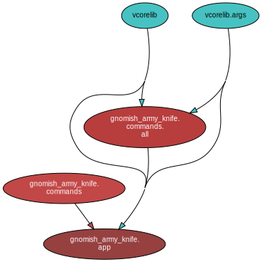

<!--
    =====================================
    generator=datazen
    version=3.2.0
    hash=9f6a872fa775bfde2ead305dfcda1116
    =====================================
-->

[](https://www.wowhead.com/item=40772/gnomish-army-knife)

# gnomish-army-knife ([1.5.5](https://pypi.org/project/gnomish-army-knife/))

[](https://pypi.org/project/gnomish-army-knife/)

[](https://codecov.io/github/vkottler/gnomish-army-knife)


*World of Warcraft polyfills and standardization.*

## Documentation

### Generated

* By [sphinx-apidoc](https://vkottler.github.io/python/sphinx/gnomish-army-knife)
(What's [`sphinx-apidoc`](https://www.sphinx-doc.org/en/master/man/sphinx-apidoc.html)?)
* By [pydoc](https://vkottler.github.io/python/pydoc/gnomish_army_knife.html)
(What's [`pydoc`](https://docs.python.org/3/library/pydoc.html)?)

## Python Version Support

This package is tested with the following Python minor versions:

* [`python3.12`](https://docs.python.org/3.12/)
* [`python3.13`](https://docs.python.org/3.13/)

## Platform Support

This package is tested on the following platforms:

* `ubuntu-latest`
* `macos-latest`
* `windows-latest`

# Introduction

LUA source hosted [here](https://github.com/vkottler/gak-lua) for
[CurseForge](https://www.curseforge.com/wow) integration.

# Command-line Options

```
$ ./venv3.12/bin/gak -h

usage: gak [-h] [--version] [-v] [-q] [--curses] [--no-uvloop] [-C DIR]
           {markdown,scan,noop} ...

World of Warcraft polyfills and standardization.

options:
  -h, --help            show this help message and exit
  --version             show program's version number and exit
  -v, --verbose         set to increase logging verbosity
  -q, --quiet           set to reduce output
  --curses              whether or not to use curses.wrapper when starting
  --no-uvloop           whether or not to disable uvloop as event loop driver
  -C DIR, --dir DIR     execute from a specific directory

commands:
  {markdown,scan,noop}  set of available commands
    markdown            generate Markdown content from class data
    scan                scan the 'World of Warcraft' directory for updates
    noop                command stub (does nothing)

```

## Sub-command Options

### `markdown`

```
$ ./venv3.12/bin/gak markdown -h

usage: gak markdown [-h] [-o OUTPUT] [-d DATABASE]

options:
  -h, --help            show this help message and exit
  -o OUTPUT, --output OUTPUT
                        output directory (default: 'gnomish-army-knife-
                        markdown')
  -d DATABASE, --database DATABASE
                        macro database (default:
                        'package://gnomish_army_knife/macros.yaml')

```

### `scan`

```
$ ./venv3.12/bin/gak scan -h

usage: gak scan [-h] [-c CONFIG] [-s STATE] [-e]

options:
  -h, --help            show this help message and exit
  -c CONFIG, --config CONFIG
                        path to an optional configuration file (default:
                        'gak.yaml')
  -s STATE, --state STATE
                        path to the program's state directory (default:
                        '/home/vkottler/.local/state/gak')
  -e, --ephemeral       set to use new, temporary directories when applicable

```

# Internal Dependency Graph

A coarse view of the internal structure and scale of
`gnomish-army-knife`'s source.
Generated using [pydeps](https://github.com/thebjorn/pydeps) (via
`mk python-deps`).


